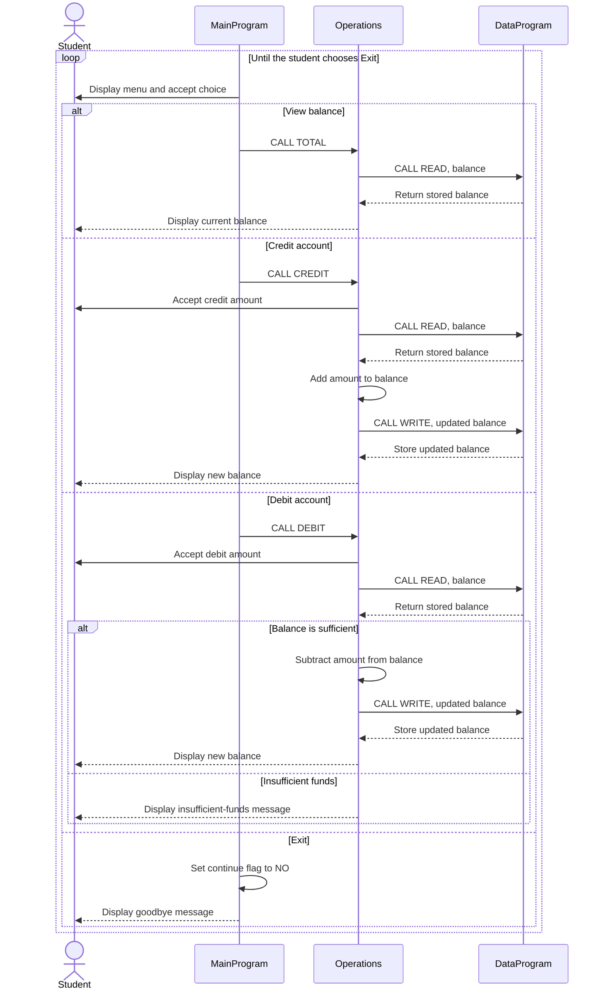

# COBOL Account Management

This directory documents the COBOL account-management example in `src/cobol`. The program provides a simple interactive account for a student: users can view the balance, credit funds, debit funds, or exit.

## Program Structure

### `main.cob` - `MainProgram`

`MainProgram` is the user-facing entry point. It repeatedly displays the account-management menu, accepts a numeric choice, and dispatches the selected action to `Operations`:

- `1` calls `Operations` with `TOTAL ` to display the current balance.
- `2` calls `Operations` with `CREDIT` to add funds.
- `3` calls `Operations` with `DEBIT ` to withdraw funds.
- `4` sets the continue flag to `NO` and exits the loop.
- Any other input displays an invalid-choice message.

The program ends with `STOP RUN` after the user selects option 4.

### `operations.cob` - `Operations`

`Operations` contains the account transaction logic. It receives a six-character operation code and performs one of these actions:

- `TOTAL ` reads the stored balance and displays it.
- `CREDIT` accepts an amount, reads the current balance, adds the amount, writes the updated balance, and displays the result.
- `DEBIT ` accepts an amount, reads the current balance, and only writes the withdrawal when sufficient funds are available.

The program calls `DataProgram` for all balance reads and writes, keeping transaction logic separate from storage logic.

### `data.cob` - `DataProgram`

`DataProgram` provides the balance store through a two-operation interface:

- `READ` copies the stored balance into the caller-provided `BALANCE` field.
- `WRITE` replaces the stored balance with the caller-provided value.

The stored balance starts at `1000.00`. The value is held in working storage, so this example does not persist account data to a file or database after the program ends.

## Business Rules

- A new account starts with a balance of `1000.00`.
- A credit increases the balance by the entered amount.
- A debit is accepted only when the entered amount is less than or equal to the current balance.
- A debit that exceeds the current balance is rejected and displays `Insufficient funds for this debit.`.
- A rejected debit does not write a new balance.
- The example models one account balance; it does not identify students or maintain multiple accounts.
- Amounts use `PIC 9(6)V99`, allowing up to six whole-number digits and two implied decimal places.
- The current code does not validate that credit or debit amounts are positive, nor does it validate malformed numeric input. Negative or zero amounts therefore require additional validation if those cases are not allowed by the intended business rules.

## Runtime Flow

```text
MainProgram
    -> Operations (TOTAL / CREDIT / DEBIT)
        -> DataProgram (READ)
        -> DataProgram (WRITE for successful CREDIT or DEBIT)
```

Operation codes are six characters wide. The trailing spaces in `TOTAL ` and `DEBIT ` are significant because they match the `PIC X(6)` fields used by the called programs.

## Application Data Flow


